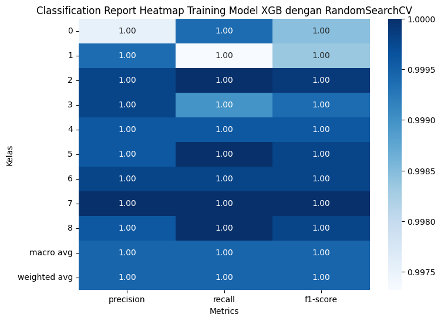
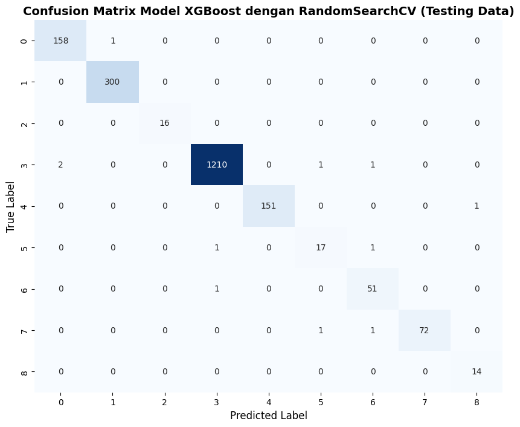

# 📦 Paketin — Telecommunication Package Recommender System

Sistem rekomendasi paket telekomunikasi berbasis Machine Learning yang memprediksi penawaran terbaik sesuai profil dan perilaku penggunaan pelanggan. Model di-serve melalui REST API menggunakan Flask.

> 🎓 Capstone Project — Program **Asah by Dicoding x Accenture**
> Role: **Machine Learning Engineer**

---

## 🗂️ Struktur Proyek

```
Recommender-System-Paketin/
├── Notebook-A25-CS006.ipynb       # Notebook eksplorasi, training, dan evaluasi model
├── app.py                         # Flask API server
├── preprocessor_trans.joblib      # Pipeline preprocessing (encoding + scaling fitur)
├── model_trans.joblib             # Model XGBoost terlatih
├── encoder_label_trans.joblib     # Label encoder untuk output prediksi
├── scaler.joblib                  # Scaler numerik
├── requirements.txt               # Dependensi Python
└── .gitignore
```

---

## ⚙️ Tech Stack

| Komponen | Library / Framework |
|---|---|
| API Server | Flask 3.1.2 |
| Model | XGBoost 3.1.2 |
| Preprocessing | Scikit-learn 1.6.1 |
| Data Processing | Pandas 2.2.2, NumPy 2.0.2 |
| Serialisasi Model | Joblib 1.5.2 |

---

## 🎯 Label Prediksi

Model mengklasifikasikan pelanggan ke dalam 9 kategori penawaran:

| Kode | Label |
|---|---|
| 0 | Data Booster |
| 1 | Device Upgrade Offer |
| 2 | Family Plan Offer |
| 3 | General Offer |
| 4 | Retention Offer |
| 5 | Roaming Pass |
| 6 | Streaming Partner Pack |
| 7 | Top-up Promo |
| 8 | Voice Bundle |

---

## 📊 Performa Model

Model XGBoost dioptimasi menggunakan **RandomSearchCV** pada data testing:

| Metrik | Macro Avg | Weighted Avg |
|---|---|---|
| Precision | 0.97 | 0.99 |
| Recall | 0.98 | 0.99 |
| F1-Score | 0.98 | 0.99 |

Mayoritas kelas mencapai F1-Score ≥ 0.96, dengan kelas General Offer (label 3) sebagai kelas terbesar (1210 sampel) dan performa sempurna. Kelas Roaming Pass (label 5) memiliki performa terendah namun tetap di angka F1 0.89 — wajar mengingat sampelnya paling sedikit.

### Classification Report


### Confusion Matrix


---

## 🚀 Cara Menjalankan

### 1. Clone repository

```bash
git clone https://github.com/YazidHilmi/Recommender-System-Paketin.git
cd Recommender-System-Paketin
```

### 2. Install dependensi

```bash
pip install -r requirements.txt
```

### 3. Jalankan Flask server

```bash
python app.py
```

Server berjalan di `http://localhost:5000`.

---

## 🔌 API Endpoint

### `GET /`
Cek status API.

**Response:**
```
API Prediksi Model Berjalan! Kirim POST ke /predict
```

---

### `POST /predict`
Menerima data profil pelanggan dan mengembalikan rekomendasi penawaran paket.

**Request Body (JSON):**

```json
{
  "plan_type": "prepaid",
  "device_brand": "Samsung",
  "avg_data_usage_gb": 15.5,
  "pct_video_usage": 0.45,
  "avg_call_duration": 8.2,
  "sms_freq": 12,
  "monthly_spend": 85000,
  "topup_freq": 3,
  "travel_score": 0.6,
  "complaint_count": 1
}
```

**Deskripsi Fitur:**

| Fitur | Tipe | Deskripsi |
|---|---|---|
| `plan_type` | string | Tipe paket saat ini (`prepaid` / `postpaid`) |
| `device_brand` | string | Merek perangkat pelanggan |
| `avg_data_usage_gb` | float | Rata-rata penggunaan data (GB/bulan) |
| `pct_video_usage` | float | Persentase penggunaan untuk video (0–1) |
| `avg_call_duration` | float | Rata-rata durasi panggilan (menit) |
| `sms_freq` | int | Frekuensi pengiriman SMS per bulan |
| `monthly_spend` | float | Total pengeluaran bulanan (Rp) |
| `topup_freq` | int | Frekuensi top-up per bulan |
| `travel_score` | float | Skor mobilitas/perjalanan pelanggan (0–1) |
| `complaint_count` | int | Jumlah komplain yang pernah diajukan |

**Response Sukses:**

```json
{
  "prediction_value": 6,
  "label_prediction": "Streaming Partner Pack"
}
```

**Response Error:**

```json
{
  "error": "...",
  "message": "Terjadi kesalahan saat memproses data."
}
```

---

## 📋 Contoh Request dengan cURL

```bash
curl -X POST http://localhost:5000/predict \
  -H "Content-Type: application/json" \
  -d '{
    "plan_type": "prepaid",
    "device_brand": "Samsung",
    "avg_data_usage_gb": 15.5,
    "pct_video_usage": 0.45,
    "avg_call_duration": 8.2,
    "sms_freq": 12,
    "monthly_spend": 85000,
    "topup_freq": 3,
    "travel_score": 0.6,
    "complaint_count": 1
  }'
```

---

## 👤 Author

**Yazid Hilmi** — ML Engineer | [GitHub](https://github.com/YazidHilmi)

---

> Capstone Project — Program Asah by Dicoding x Accenture
